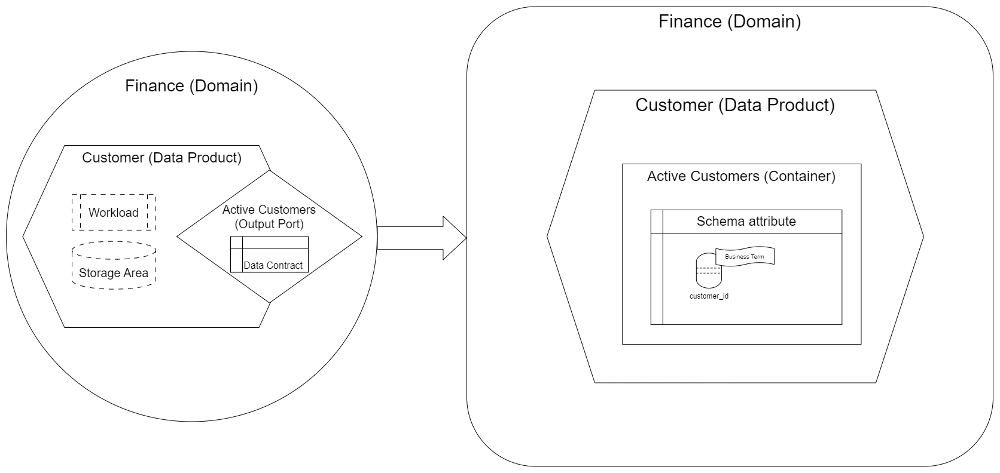
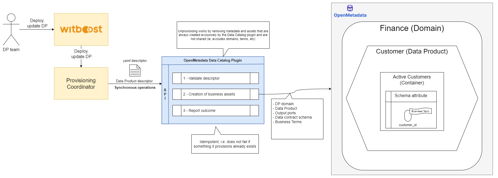
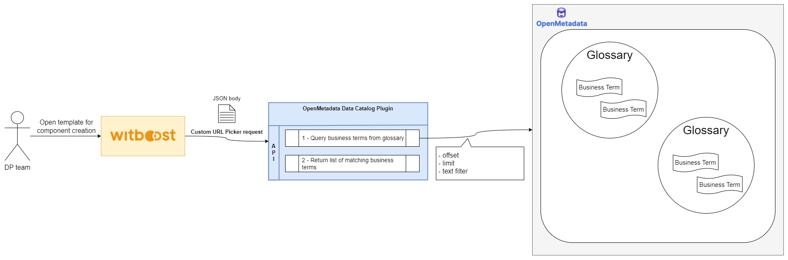

# HLD

This document describes the design of the Data Catalog Plugin for OpenMetadata. The source diagrams can be found and edited in the [accompanying draw.io file](HLD.drawio).

## Overview

### Data Catalog Plugin

A Data Catalog Plugin is a service in charge of publishing a Data Product onto a Data Catalog as part of the provisioning process on Witboost.

The Data Catalog Plugin is invoked by an upstream service of the Witboost platform, namely the Coordinator,  which is in charge of orchestrating the creation of a complex infrastructure by coordinating all the Data Product resource provisioning tasks performed by Tech Adapters (also known as Specific Provisioners) in a single workflow. The Data Catalog Plugin is called after all the Tech Adapters have successfully deployed their resources and receives a _Data Product descriptor_ as input with all the components of said Data Product, including any extra information that the Tech Adapters have returned as output of their operations.

To enable the above orchestration the Data Catalog Plugin exposes an API made up of four main operations:

- validate: checks if the provided data product descriptor is valid and reports any errors
- provision: publishes the validated descriptor on a data catalog; clients either receive an immediate response (synchronous) or a token to monitor the provisioning process (asynchronous)
- status: for asynchronous provisioning, provides the current status of a provisioning request using the provided token
- unprovision: unpublishes the previously created descriptor.

### OpenMetadata

OpenMetadata is a unified platform for discovery, observability, and governance powered by a central metadata repository, in-depth lineage, and seamless team collaboration. It is one of the fastest-growing open-source projects with a vibrant community and adoption by a diverse set of companies in a variety of industry verticals. Based on Open Metadata Standards and APIs, supporting connectors to a wide range of data services, OpenMetadata enables end-to-end metadata management, giving you the freedom to unlock the value of your data assets.

For more information, please refer to the [official documentation](https://docs.open-metadata.org).

#### Mapping between Witboost and OpenMetadata

Data Mesh entities in Witboost are mapped to OpenMetadata concepts as follows:

| Witboost                       | OpenMetadata                                                                                                                                                                                          |
|--------------------------------|--------------------------------|
| Domain "Finance"               | `Domain` "Finance" |
| Data Product "Customer"        | `Data Product` "Customer" associated to the specific `Domain` "Finance"                                                                                                                             |
| Output Port "Active Customers" | `Asset` "Active Customers" defined as a `Container`  associated to `Data Product` "Customer"          and `Domain` "Finance"                                                                                                                   |
| Column "customer_id" of Data Contract schema          | `Column` "customer_id" in `schema` of `Asset` "Active Customers"                                                                                                                   |
| Business term "Customer Identifier" on column "customer_id"           | `Business term` "Customer Identifier" associated to "customer_id" `Column` in `schema` of `Asset` "Active Customers"                                                                                                                   |

This mapping relies only on the basic building blocks of OpenMetadata and the packaged asset types that it provides out of the box.

An `Output Port` is mapped to an OpenMetadata `Container` entity type. This comes with the need to define a **fake** `Storage Service` to be associated with the `Container` itself. This configurable service is deployed at runtime by the Data Catalog Plugin.

A `domainType` is required to create a `domain` instance. The type to use among `Source-aligned`, `Consumer-aligned`, `Aggregate` can be specified in configuration.

In summary, tha mapping that takes place looks like this:

## Validating

Currently, the OpenMetadata Data Catalog Plugin performs a simple validation of the descriptor checking its compliance with the Data Product Specification.

1. **Validate descriptor**: Upon receiving a Data Product descriptor, it is validated, checking for consistency and all required fields.

## Provisioning

1. **Validate descriptor**: Upon receiving a Data Product descriptor, it is validated, checking for consistency and all required fields.
2. **Creation of business assets**: After validation, the Data Catalog Plugin will provision the assets/relationships on OpenMetadata as per the above table.
3. **Report Outcome**: After the assets have been published, the Data Catalog Plugin returns a `ProvisioningStatus`. This status confirms the successful creation of the assets, containing the necessary links to the OpenMetadata UI.

## Unprovisioning

1. **Validate descriptor**: Upon receiving a Data Product descriptor, it is validated, checking for consistency and all required fields.
2. **Deletion of business assets**: After validation, the Data Catalog Plugin will unprovision all the previously created assets/relationships, except Domain and Terms, as they can be used by other Data Products in the Data Catalog.
3. **Report Outcome**: After the assets have been removed, the Data Catalog Plugin returns a `ProvisioningStatus`. This status confirms the successful deletion of the assets.

## Business term retrieval

Retrieval of business terms is tied to the Custom URL Picker endpoints, useful to retrieve the list of allowed values from OpenMetadata Data Catalog to use during the creation of a component.

1. **Query business terms from glossary**: Upon receiving a Custom URL Picker requests, a query is sent to OpenMetadata using the request body inputs including offset, limit, an optional text filter.
2. **Return list of matching business terms**: After the query is resolved, its results are sent back to Witboost, sending the business term id and its value.

